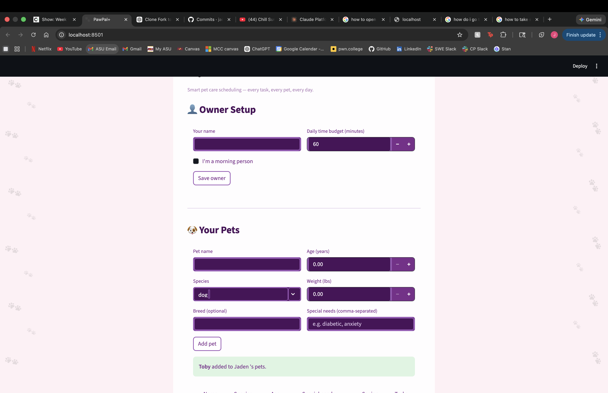

# PawPal+ (Module 2 Project)

## 📸 Demo



You are building **PawPal+**, a Streamlit app that helps a pet owner plan care tasks for their pet.

## Scenario

A busy pet owner needs help staying consistent with pet care. They want an assistant that can:

- Track pet care tasks (walks, feeding, meds, enrichment, grooming, etc.)
- Consider constraints (time available, priority, owner preferences)
- Produce a daily plan and explain why it chose that plan

Your job is to design the system first (UML), then implement the logic in Python, then connect it to the Streamlit UI.

## What you will build

Your final app should:

- Let a user enter basic owner + pet info
- Let a user add/edit tasks (duration + priority at minimum)
- Generate a daily schedule/plan based on constraints and priorities
- Display the plan clearly (and ideally explain the reasoning)
- Include tests for the most important scheduling behaviors

## Smarter Scheduling

Four algorithmic improvements were added to `pawpal_system.py` to make the scheduler more useful for real pet care routines.

### Task sorting by time slot
Tasks can be sorted into chronological display order (morning → afternoon → evening → flexible) using a `TIME_RANK` dict lookup as the `key` argument to Python's `sorted()`. This replaces a slower list `.index()` scan and makes it easy to add a secondary sort key (e.g. priority descending within the same slot).

### Filtering by pet or completion status (`Owner`)
Two filter methods were added to the `Owner` class:

| Method | What it returns |
|---|---|
| `filter_by_pet(pet_name)` | Every `(Pet, Task)` pair for a single named pet (case-insensitive) |
| `filter_by_status(completed)` | Every pair where `task.completed` matches the given `True`/`False` |

Both delegate to `get_all_tasks()` and apply a list comprehension so callers can combine them freely — e.g. pending tasks for one pet, sorted by time.

### Recurring task auto-scheduling (`Task.next_occurrence`)
`Task` now stores a `due_date` (defaults to today). When `Scheduler.mark_complete()` is called on a `"daily"` or `"weekly"` task, it automatically calls `task.next_occurrence()`, which clones the task with `due_date` advanced by 1 or 7 days respectively, and appends it to the pet's task list. Tasks with frequency `"once"` or `"as_needed"` return `None` — no recurrence is spawned.

### Conflict detection (`Scheduler.find_conflicts`)
After a plan is generated, `find_conflicts()` scans the scheduled tasks for two types of problems without raising exceptions:

- **Same-pet conflict** — one pet has two or more tasks assigned to the same time slot.
- **Slot overload** — the total duration of tasks in a slot exceeds its capacity (morning/afternoon: 120 min, evening: 90 min).

Each issue is returned as a plain warning string in a list. `get_plan_summary()` appends these warnings at the bottom of every printed plan automatically.

## Getting started

### Setup

```bash
python -m venv .venv
source .venv/bin/activate  # Windows: .venv\Scripts\activate
pip install -r requirements.txt
```

### Suggested workflow

1. Read the scenario carefully and identify requirements and edge cases.
2. Draft a UML diagram (classes, attributes, methods, relationships).
3. Convert UML into Python class stubs (no logic yet).
4. Implement scheduling logic in small increments.
5. Add tests to verify key behaviors.
6. Connect your logic to the Streamlit UI in `app.py`.
7. Refine UML so it matches what you actually built.

## Testing PawPal+

### How to run

```bash
python3 -m pytest tests/ -v
```

### What the tests cover

The suite contains **9 tests** across 5 categories:

| # | Test | What it verifies |
|---|------|-----------------|
| 1 | `test_mark_complete_changes_task_status` | `Scheduler.mark_complete()` flips `task.completed` to `True` and returns `True` |
| 2 | `test_add_task_increases_pet_task_count` | `Pet.add_task()` grows the task list by exactly 1 each call |
| 3 | `test_plan_sorted_by_time_preference` | After `generate_plan()`, tasks appear in morning → afternoon → evening order |
| 4 | `test_higher_priority_task_scheduled_before_lower` | When the budget fits only one task, the higher-priority task wins |
| 5 | `test_daily_task_creates_next_occurrence_after_completion` | Completing a `daily` task auto-adds a new task with `due_date + 1 day` |
| 6 | `test_once_task_does_not_recur_after_completion` | Completing a `once` task does **not** spawn a recurrence |
| 7 | `test_same_pet_same_slot_triggers_conflict_warning` | Two tasks for the same pet in the same slot produce a conflict warning |
| 8 | `test_slot_overload_triggers_conflict_warning` | Tasks totaling > 90 min in the evening slot trigger an overload warning |
| 9 | `test_no_conflict_when_tasks_in_different_slots` | Tasks in separate slots produce zero warnings |

### Latest results

```
9 passed in 0.01s
```

### Confidence Level

**★★★★☆ (4/5)**

The core scheduling behaviors — priority selection, time-slot display order, daily recurrence, one-time task cleanup, and both conflict types — are all tested and passing. One star is held back because the suite does not yet cover a few known edge cases: the special-needs priority boost capping at 5, the `weekly` recurrence interval, owner budget = 0 (all tasks skipped), and the `morning_person: false` display-order reversal. Those paths exist in the code but have no automated safety net yet.
